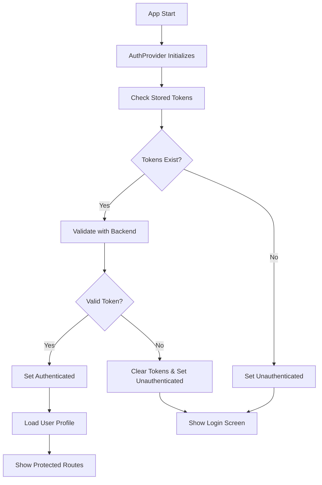

# Authentication System Documentation

## Overview

The Tiffin-Wale Student App implements a comprehensive, secure authentication system that protects all routes and ensures proper user access control. This system prevents unauthorized access to protected routes and handles authentication failures gracefully.

## Architecture

### Core Components

1. **AuthStore** (`store/authStore.ts`) - Zustand-based state management
2. **AuthService** (`utils/authService.ts`) - Token management and API calls
3. **RouteGuard** (`components/RouteGuard.tsx`) - Route protection components
4. **AuthProvider** (`context/AuthProvider.tsx`) - Global authentication context
5. **API Client** (`utils/apiClient.ts`) - HTTP client with auth interceptors

### Authentication Flow



## Route Protection

### Protected Routes
All routes except authentication pages are protected by default:

- `/(tabs)/*` - Main app tabs (Home, Orders, Track, Plans, Profile)
- `/dashboard` - Dashboard screen
- `/customize-meal` - Meal customization
- `/delivery-addresses` - Address management
- `/account-information` - User profile
- `/help-support` - Support pages
- `/subscription-checkout` - Subscription management
- `/faq` - FAQ pages
- `/active-subscription-plan` - Plan management
- `/payment-methods` - Payment settings

### Public Routes
Only these routes are accessible without authentication:

- `/(auth)/*` - Login and registration pages
- `/` - Root redirect page
- `/+not-found` - 404 error page

### Route Guard Components

```tsx
// Protect a route with authentication
<ProtectedRoute>
  <YourComponent />
</ProtectedRoute>

// Public route (redirects authenticated users away)
<PublicRoute>
  <LoginComponent />
</PublicRoute>

// Route with specific permissions
<CustomerRoute>
  <CustomerOnlyComponent />
</CustomerRoute>
```

## Security Features

### Token Management
- **Access Token**: Short-lived JWT for API requests
- **Refresh Token**: Long-lived token for renewing access tokens
- **Automatic Refresh**: Tokens are refreshed before expiration
- **Secure Storage**: Tokens stored in AsyncStorage (encrypted in production)

### Authentication Validation
- **Startup Check**: Validates stored tokens on app launch
- **Periodic Validation**: Checks token validity every 5 minutes
- **API Interceptors**: Automatically handles 401 responses
- **Graceful Degradation**: Falls back to login on auth failures

### Error Handling
- **Network Errors**: Proper error messages for connection issues
- **Invalid Credentials**: Clear feedback for login failures
- **Token Expiration**: Automatic logout and redirect
- **Session Timeout**: Handles long periods of inactivity

## Usage Examples

### Basic Route Protection

```tsx
import { ProtectedRoute } from '@/components/RouteGuard';

export default function MyProtectedScreen() {
  return (
    <ProtectedRoute>
      <View>
        <Text>This content is only visible to authenticated users</Text>
      </View>
    </ProtectedRoute>
  );
}
```

### Using Authentication State

```tsx
import { useAuthContext } from '@/context/AuthProvider';

export default function MyComponent() {
  const { isAuthenticated, user, logout } = useAuthContext();
  
  if (!isAuthenticated) {
    return <Text>Please log in</Text>;
  }
  
  return (
    <View>
      <Text>Welcome, {user?.firstName}!</Text>
      <Button onPress={logout} title="Logout" />
    </View>
  );
}
```

### Custom Authentication Logic

```tsx
import { RouteGuard } from '@/components/RouteGuard';

export default function AdminOnlyScreen() {
  return (
    <RouteGuard requireAuth={true} permissions={['admin']}>
      <View>
        <Text>Admin-only content</Text>
      </View>
    </RouteGuard>
  );
}
```

## Testing

### Running Authentication Tests

```tsx
import authTest from '@/utils/authTest';

// Run all tests
await authTest.runAllTests();

// Run specific tests
await authTest.testAuthFlow();
authTest.testRouteProtection();
await authTest.testErrorHandling();
```

### Test Coverage

The authentication system includes comprehensive tests for:

- ✅ Authentication flow (login, logout, token validation)
- ✅ Route protection (public vs protected routes)
- ✅ Error handling (invalid credentials, network errors)
- ✅ Token refresh and expiration
- ✅ State management and persistence

## Configuration

### Environment Variables

```env
# API Configuration
API_BASE_URL=http://127.0.0.1:3001
EXPO_PUBLIC_API_BASE_URL=http://127.0.0.1:3001

# Token Configuration
TOKEN_REFRESH_INTERVAL=300000  # 5 minutes
TOKEN_VALIDATION_ENDPOINT=/customers/profile
```

### Customization

#### Token Refresh Interval
```tsx
// In AuthProvider.tsx
const checkAuthInterval = setInterval(async () => {
  // ... token validation logic
}, 5 * 60 * 1000); // Adjust this value
```

#### Custom Permission Checks
```tsx
// In RouteGuard.tsx
const hasPermission = permissions.some(permission => {
  // Implement your custom permission logic here
  return user.role === permission || user.permissions?.includes(permission);
});
```

## Troubleshooting

### Common Issues

1. **Routes Not Protected**
   - Ensure `ProtectedRoute` wraps protected components
   - Check that `AuthProvider` is at the root level
   - Verify authentication state is properly initialized

2. **Authentication State Not Persisting**
   - Check AsyncStorage permissions
   - Verify token storage keys are consistent
   - Ensure proper error handling in auth initialization

3. **Infinite Redirects**
   - Check authentication state logic
   - Verify route guard conditions
   - Ensure proper loading states

4. **Token Refresh Failures**
   - Check refresh token endpoint
   - Verify token storage consistency
   - Check network connectivity

### Debug Mode

Enable debug logging by setting:

```tsx
// In authService.ts or authStore.ts
const DEBUG = true;

if (DEBUG) {
  console.log('Auth Debug:', { action, data });
}
```

## Best Practices

### Security
- Never store sensitive data in plain text
- Always validate tokens with the backend
- Implement proper session timeout
- Use HTTPS in production

### Performance
- Minimize authentication checks
- Implement proper loading states
- Cache user data when appropriate
- Use efficient token validation

### User Experience
- Provide clear error messages
- Implement smooth loading transitions
- Handle offline scenarios gracefully
- Maintain user context during navigation

## Future Enhancements

### Planned Features
- [ ] Biometric authentication support
- [ ] Multi-factor authentication
- [ ] Social login integration
- [ ] Advanced permission system
- [ ] Audit logging
- [ ] Session management dashboard

### Scalability Considerations
- [ ] Token rotation strategies
- [ ] Distributed session management
- [ ] Rate limiting for auth endpoints
- [ ] Caching strategies for user data

## Support

For authentication system issues:

1. Check the console for error messages
2. Run authentication tests using `authTest.runAllTests()`
3. Verify environment configuration
4. Check network connectivity to backend
5. Review authentication state in React DevTools

---

*This documentation should be updated whenever the authentication system is modified.*

