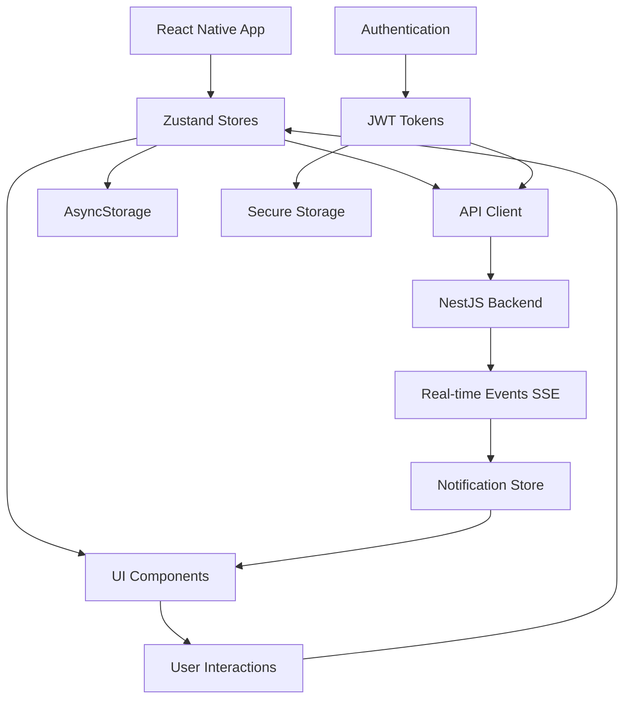
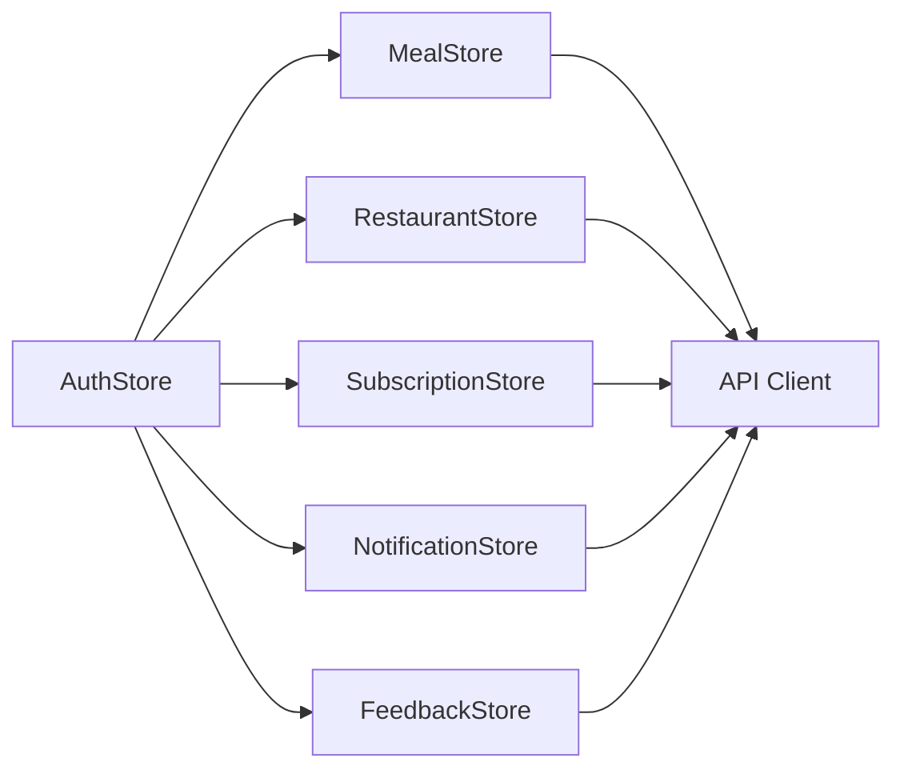
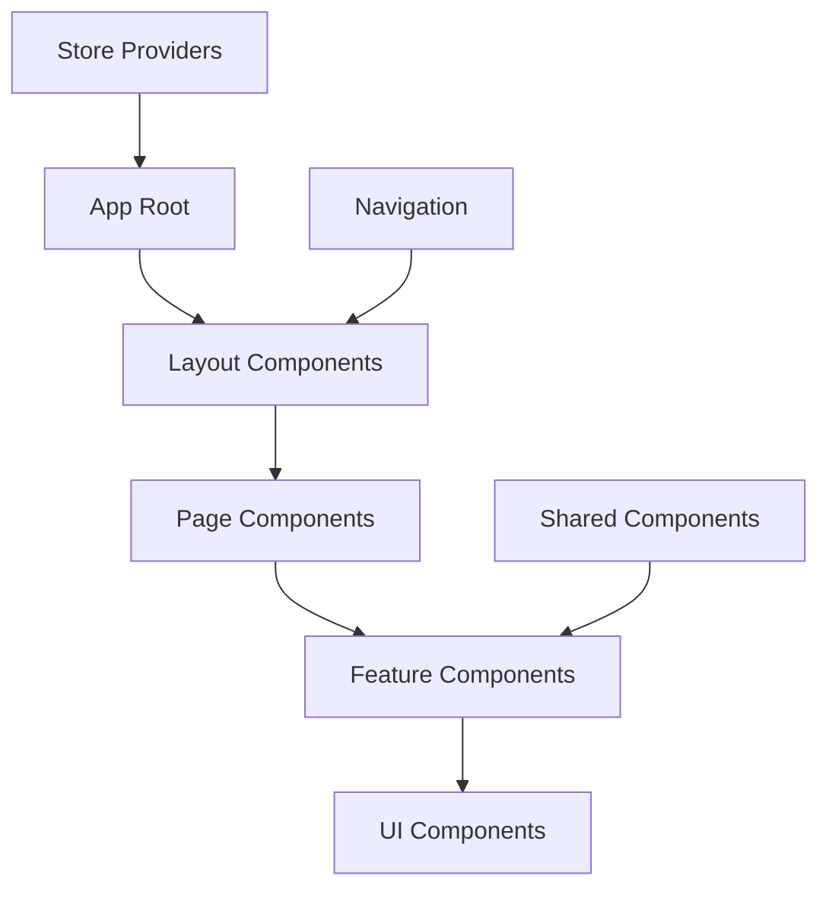

# TiffinWale Student App - Technical Architecture

## 🏗️ Architecture Overview

The TiffinWale Student App follows a modern, scalable architecture pattern with clear separation of concerns and maintainable code structure.

## 📱 Technology Stack

### **Frontend Framework**
- **React Native** - Cross-platform mobile framework
- **Expo** - Development platform and toolchain
- **TypeScript** - Type-safe JavaScript development
- **Expo Router** - File-based routing system

### **State Management**
- **Zustand** - Lightweight state management
- **AsyncStorage** - Local data persistence
- **Expo SecureStore** - Secure credential storage

### **API Integration**
- **Axios** - HTTP client with interceptors
- **Server-Sent Events (SSE)** - Real-time communication
- **JWT Authentication** - Secure API access

### **Development Tools**
- **ESLint** - Code linting
- **Prettier** - Code formatting
- **TypeScript Compiler** - Type checking

## 🏗️ Project Structure

```
interface/student-app/
├── app/                          # Expo Router pages
│   ├── (auth)/                   # Authentication flow
│   │   ├── login.tsx
│   │   ├── signup.tsx
│   │   └── _layout.tsx
│   ├── (tabs)/                   # Main app tabs
│   │   ├── index.tsx             # Home dashboard
│   │   ├── orders.tsx            # Order history
│   │   ├── plans.tsx             # Subscription plans
│   │   ├── profile.tsx           # User profile
│   │   └── track.tsx             # Order tracking
│   ├── restaurant/               # Restaurant details
│   │   └── [id].tsx
│   └── +not-found.tsx           # 404 page
├── assets/                       # Static assets
│   └── images/
├── components/                   # Reusable UI components
│   ├── ActiveSubscriptionDashboard.tsx
│   ├── MealCard.tsx
│   ├── AdditionalOrderCard.tsx
│   └── ...
├── store/                        # Zustand state stores
│   ├── authStore.ts              # Authentication state
│   ├── mealStore.ts              # Meal data management
│   ├── restaurantStore.ts        # Restaurant/partner data
│   ├── subscriptionStore.ts      # Subscription management
│   ├── notificationStore.ts      # Real-time notifications
│   └── feedbackStore.ts          # User feedback
├── utils/                        # Utility functions
│   ├── apiClient.ts              # API client configuration
│   ├── authService.ts            # Authentication utilities
│   └── constants.ts              # App constants
├── types/                        # TypeScript type definitions
│   ├── api.ts                    # API response types
│   ├── auth.ts                   # Authentication types
│   └── ...
├── hooks/                        # Custom React hooks
│   └── useFrameworkReady.ts
└── docs/                         # Documentation
    ├── README.md
    ├── API_Integration_Guide.md
    └── Technical_Architecture.md
```

## 🔄 Data Flow Architecture



## 🗃️ State Management Pattern

### **Zustand Store Pattern**
Each feature has its own dedicated store following a consistent pattern:

```typescript
interface StoreState {
  // Data
  data: DataType[];
  
  // Loading states
  isLoading: boolean;
  isRefreshing: boolean;
  
  // Error handling
  error: string | null;
  
  // Actions
  fetchData: () => Promise<void>;
  updateData: (id: string, data: Partial<DataType>) => Promise<void>;
  clearError: () => void;
}
```

### **Store Dependencies**


## 🔐 Authentication Architecture

### **JWT Token Flow**
1. **Login**: User credentials → Backend → JWT access/refresh tokens
2. **Storage**: Tokens stored in Expo SecureStore
3. **API Calls**: Access token automatically added to headers
4. **Refresh**: Automatic token refresh on 401 errors
5. **Logout**: Tokens cleared from storage

### **Authentication Guards**
```typescript
// API Client automatically handles authentication
apiClient.interceptors.request.use((config) => {
  const token = authStore.getState().accessToken;
  if (token) {
    config.headers.Authorization = `Bearer ${token}`;
  }
  return config;
});

apiClient.interceptors.response.use(
  (response) => response,
  async (error) => {
    if (error.response?.status === 401) {
      await authStore.getState().refreshToken();
      // Retry original request
    }
    return Promise.reject(error);
  }
);
```

## 🔄 Real-time Communication

### **Server-Sent Events (SSE)**
Real-time features implemented using SSE for:
- Order status updates
- Live notifications
- System announcements

```typescript
// SSE Connection Management
const eventSource = new EventSource(`${API_BASE_URL}/notifications/stream`);

eventSource.onmessage = (event) => {
  const data = JSON.parse(event.data);
  notificationStore.getState().addNotification(data);
};

eventSource.onerror = () => {
  // Reconnection logic
  setTimeout(() => {
    notificationStore.getState().reconnectSSE();
  }, 5000);
};
```

## 📱 Navigation Architecture

### **Expo Router Structure**
- **File-based routing** for intuitive navigation
- **Nested layouts** for shared UI elements
- **Dynamic routes** for parameterized pages
- **Tab navigation** for main app sections

```typescript
// Route Structure
app/
├── (auth)/           # Auth flow: /login, /signup
├── (tabs)/           # Tab navigation: /, /orders, /plans
├── restaurant/[id]   # Dynamic route: /restaurant/123
└── modal/           # Modal presentations
```

## 🎨 Component Architecture

### **Component Hierarchy**


### **Component Design Principles**
1. **Single Responsibility**: Each component has one clear purpose
2. **Reusability**: Components designed for reuse across features
3. **Type Safety**: Full TypeScript integration
4. **Performance**: Optimized rendering with proper memo usage
5. **Accessibility**: Built-in accessibility support

## 🔧 API Integration Architecture

### **Centralized API Client**
All backend communication flows through a single, configured Axios instance:

```typescript
// utils/apiClient.ts
const apiClient = axios.create({
  baseURL: API_BASE_URL,
  timeout: 10000,
  headers: {
    'Content-Type': 'application/json',
  },
});

// Organized endpoint definitions
export const api = {
  auth: {
    login: (credentials) => apiClient.post('/auth/login', credentials),
    register: (userData) => apiClient.post('/auth/register', userData),
    // ...
  },
  meals: {
    getToday: () => apiClient.get('/meals/today'),
    getHistory: () => apiClient.get('/meals/history'),
    // ...
  },
  // ... all other modules
};
```

### **Error Handling Strategy**
```typescript
// Centralized error handling
const handleApiError = (error: AxiosError) => {
  if (error.response?.status === 401) {
    // Redirect to login
    authStore.getState().logout();
  } else if (error.response?.status >= 500) {
    // Show server error message
    showToast('Server error. Please try again later.');
  } else {
    // Show specific error message
    showToast(error.response?.data?.message || 'An error occurred');
  }
};
```

## ⚡ Performance Optimizations

### **Implemented Optimizations**
1. **Component Memoization**: React.memo for expensive components
2. **Lazy Loading**: Code splitting for large components
3. **Image Optimization**: Compressed images with proper formats
4. **API Caching**: Smart caching strategies in stores
5. **Bundle Optimization**: Tree shaking and dead code elimination

### **Performance Monitoring**
- React DevTools integration
- Network request monitoring
- Memory usage tracking
- Bundle size analysis

## 🔒 Security Considerations

### **Data Protection**
1. **Secure Storage**: Sensitive data in Expo SecureStore
2. **API Security**: JWT tokens with proper expiration
3. **Input Validation**: Client-side validation for all forms
4. **Error Masking**: Sensitive information not exposed in errors

### **Network Security**
1. **HTTPS Only**: All API communication over HTTPS
2. **Request Timeout**: Prevent hanging requests
3. **Certificate Pinning**: (Recommended for production)
4. **Request Sanitization**: All inputs sanitized before API calls

## 🧪 Testing Strategy

### **Testing Architecture**
```
tests/
├── unit/             # Component unit tests
├── integration/      # API integration tests
├── e2e/             # End-to-end tests
└── __mocks__/       # Mock implementations
```

### **Testing Tools**
- **Jest**: Unit testing framework
- **React Native Testing Library**: Component testing
- **MSW**: API mocking for tests
- **Detox**: E2E testing (recommended)

## 🚀 Build & Deployment

### **Build Process**
1. **Development**: `expo start` for local development
2. **Preview**: `expo build` for preview builds
3. **Production**: `eas build` for app store builds

### **Environment Configuration**
```typescript
// app.config.js
export default {
  expo: {
    extra: {
      apiBaseUrl: process.env.API_BASE_URL,
      environment: process.env.NODE_ENV,
    },
  },
};
```

## 📊 Monitoring & Analytics

### **Error Tracking**
- Sentry integration for crash reporting
- Custom error boundaries for graceful failures
- API error logging and monitoring

### **Performance Metrics**
- App launch time tracking
- API response time monitoring
- User interaction analytics
- Bundle size monitoring

---

This architecture provides a solid foundation for scalable mobile app development while maintaining code quality, performance, and security standards. 